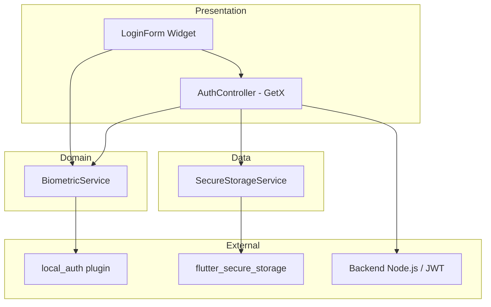
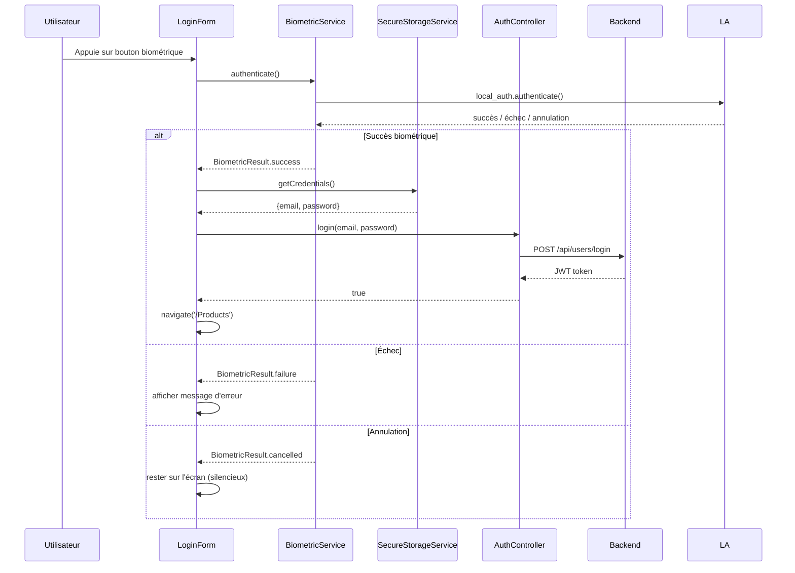

# Design Document — biometric-login

## Overview

Cette feature ajoute l'authentification biométrique (empreinte digitale / Face ID) à l'application Flutter e-commerce existante. Elle s'appuie sur le flux email/password + JWT déjà en place et ne nécessite aucune modification backend.

Principe de fonctionnement :
1. L'utilisateur se connecte une première fois via email/password.
2. L'application propose d'activer la biométrie (consentement explicite).
3. En cas d'acceptation, les credentials sont chiffrés et stockés via `flutter_secure_storage`.
4. Lors des connexions suivantes, un bouton biométrique apparaît ; la vérification est effectuée localement via `local_auth`, puis les credentials stockés sont utilisés pour appeler le backend.

Packages utilisés :
- `local_auth: ^2.3.0` — déclenchement de la vérification biométrique native (BiometricPrompt sur Android 14)
- `flutter_secure_storage: ^9.2.4` — stockage chiffré des credentials (AES sur Android via Keystore)

---

## Architecture

L'architecture suit le pattern Clean Architecture déjà en place dans le projet (data / domain / presentation).



Flux d'authentification biométrique :



---

## Components and Interfaces

### BiometricService (`lib/utils/biometric_service.dart`)

Responsabilité unique : interagir avec `local_auth`. Aucune dépendance sur GetX ou le reste de l'app.

```dart
enum BiometricResult { success, failure, cancelled, notAvailable }

abstract class IBiometricService {
  Future<bool> isAvailable();
  Future<BiometricResult> authenticate({required String reason});
}

class BiometricService implements IBiometricService {
  Future<bool> isAvailable();
  // Retourne true si l'appareil supporte la biométrie ET qu'un biométrique est enrôlé
  
  Future<BiometricResult> authenticate({required String reason});
  // Déclenche BiometricPrompt, mappe les exceptions local_auth vers BiometricResult
}
```

Mapping des exceptions `local_auth` → `BiometricResult` :
- `PlatformException(code: 'NotAvailable')` → `BiometricResult.notAvailable`
- `PlatformException(code: 'LockedOut' | 'PermanentlyLockedOut')` → `BiometricResult.failure`
- `PlatformException(code: 'UserCanceled' | 'SystemCanceled')` → `BiometricResult.cancelled`
- Toute autre exception → `BiometricResult.failure`

### SecureStorageService (`lib/utils/secure_storage_service.dart`)

Responsabilité : lire/écrire/supprimer les credentials chiffrés.

```dart
abstract class ISecureStorageService {
  Future<void> saveCredentials(String email, String password);
  Future<({String email, String password})?> getCredentials();
  Future<void> deleteCredentials();
  Future<bool> hasCredentials();
}
```

Clés de stockage (constantes privées) :
- `_kEmail = 'biometric_email'`
- `_kPassword = 'biometric_password'`

### AuthController — modifications (`lib/presentation/controllers/user.controller.dart`)

Ajouts à la classe existante :

```dart
// Nouvelles dépendances injectées
final ISecureStorageService _secureStorage;
final IBiometricService _biometricService;

// Nouvel état observable
var isBiometricAvailable = false.obs;

// Nouvelles méthodes
Future<void> checkBiometricAvailability();
Future<bool> loginWithBiometrics();
Future<void> saveBiometricCredentials(String email, String password);
// logout() modifié : appelle _secureStorage.deleteCredentials()
```

### LoginForm — modifications (`lib/presentation/widgets/loginform.widget.dart`)

- Ajout d'un `Obx` qui affiche le bouton biométrique si `_controller.isBiometricAvailable.value == true`
- Appel à `_controller.checkBiometricAvailability()` dans `initState`
- Après login email/password réussi : affichage d'un `AlertDialog` de consentement
- Gestion des `BiometricResult` retournés par `loginWithBiometrics()`

---

## Data Models

### BiometricCredentials (modèle interne, non persisté tel quel)

```dart
// Record Dart utilisé en mémoire uniquement
typedef BiometricCredentials = ({String email, String password});
```

Les credentials sont stockés sous forme de deux entrées distinctes dans `flutter_secure_storage` (pas de sérialisation JSON pour minimiser la surface d'attaque).

### Clés SecureStorage

| Clé | Type | Description |
|-----|------|-------------|
| `biometric_email` | String | Email de l'utilisateur chiffré |
| `biometric_password` | String | Mot de passe de l'utilisateur chiffré |

### État observable AuthController (ajouts)

| Champ | Type | Description |
|-------|------|-------------|
| `isBiometricAvailable` | `RxBool` | true si biométrie dispo ET credentials stockés |


---

## Correctness Properties

*A property is a characteristic or behavior that should hold true across all valid executions of a system — essentially, a formal statement about what the system should do. Properties serve as the bridge between human-readable specifications and machine-verifiable correctness guarantees.*

### Property 1 : Visibilité du bouton biométrique

*For any* état de l'application, le bouton d'authentification biométrique doit être visible si et seulement si `BiometricService.isAvailable()` retourne `true` ET `SecureStorageService.hasCredentials()` retourne `true`. Dans tous les autres cas (biométrie indisponible, credentials absents, ou les deux), le bouton doit être masqué.

**Validates: Requirements 1.2, 1.3, 1.4**

---

### Property 2 : Round-trip sauvegarde des credentials

*For any* paire (email, password) valide, si l'utilisateur accepte le consentement biométrique après un login réussi, alors `SecureStorageService.getCredentials()` doit retourner exactement les mêmes valeurs email et password qui ont été passées à `saveCredentials()`.

**Validates: Requirements 2.2**

---

### Property 3 : Round-trip authentification biométrique → login

*For any* credentials stockés dans SecureStorage, si `BiometricService.authenticate()` retourne `BiometricResult.success`, alors `AuthController.login(email, password)` doit être appelé avec exactement les credentials récupérés depuis SecureStorage.

**Validates: Requirements 3.2**

---

### Property 4 : Navigation après succès biométrique

*For any* utilisateur avec des credentials valides stockés, si la vérification biométrique réussit et que le login backend réussit, alors la navigation doit aboutir à la route `/Products` et `AuthController.isAuthenticated` doit être `true`.

**Validates: Requirements 3.3**

---

### Property 5 : Affichage d'erreur sur échec biométrique

*For any* résultat biométrique de type `BiometricResult.failure` (incluant les cas LockedOut), le LoginForm doit afficher un message d'erreur non vide, et le formulaire email/password doit rester accessible (non désactivé).

**Validates: Requirements 3.4, 4.1, 4.3**

---

### Property 6 : Suppression des credentials au logout

*For any* utilisateur authentifié avec des credentials biométriques stockés, après l'appel à `AuthController.logout()`, `SecureStorageService.hasCredentials()` doit retourner `false` et `getCredentials()` doit retourner `null`.

**Validates: Requirements 5.1**

---

### Property 7 : Nettoyage des credentials corrompus

*For any* état où SecureStorage contient des données corrompues ou partielles (ex : email présent mais password absent), `SecureStorageService.getCredentials()` doit retourner `null` et `deleteCredentials()` doit être appelé, laissant `hasCredentials()` à `false`.

**Validates: Requirements 4.2**

---

## Error Handling

### Stratégie globale

Toutes les exceptions issues de `local_auth` et `flutter_secure_storage` sont capturées dans les services et converties en types métier (`BiometricResult`, `null` pour credentials absents). Le LoginForm ne gère jamais d'exceptions brutes.

### Tableau des cas d'erreur

| Situation | Comportement attendu | Message utilisateur |
|-----------|---------------------|---------------------|
| `PlatformException(NotAvailable)` | `isAvailable()` retourne `false`, bouton masqué | — |
| `PlatformException(LockedOut)` | `BiometricResult.failure` | "Biométrie temporairement verrouillée. Utilisez email/password." |
| `PlatformException(PermanentlyLockedOut)` | `BiometricResult.failure` | "Biométrie désactivée. Utilisez email/password." |
| `PlatformException(UserCanceled)` | `BiometricResult.cancelled` | — (silencieux) |
| `PlatformException(SystemCanceled)` | `BiometricResult.cancelled` | — (silencieux) |
| Credentials corrompus en SecureStorage | Suppression + `hasCredentials() = false` | — (bouton disparaît) |
| Erreur inattendue SecureStorage | `getCredentials()` retourne `null` | — (bouton disparaît) |
| Login backend échoue après biométrie | Snackbar d'erreur existant | "Email ou mot de passe invalide" |

### Gestion de l'annulation

L'annulation (`BiometricResult.cancelled`) est traitée silencieusement : l'utilisateur reste sur l'écran de login sans aucun message. C'est le comportement UX standard pour les authentifications biométriques.

---

## Testing Strategy

### Approche duale

Les tests combinent **tests unitaires** (cas spécifiques, edge cases) et **tests de propriétés** (comportement universel sur entrées générées).

### Tests unitaires

Fichiers cibles :
- `test/utils/biometric_service_test.dart`
- `test/utils/secure_storage_service_test.dart`
- `test/presentation/controllers/auth_controller_biometric_test.dart`
- `test/presentation/widgets/loginform_biometric_test.dart`

Cas à couvrir :
- `isAvailable()` retourne `false` quand `local_auth` lève `NotAvailable`
- `authenticate()` mappe correctement chaque `PlatformException` vers `BiometricResult`
- Dialogue de consentement affiché après login réussi (widget test)
- Bouton biométrique absent quand `isBiometricAvailable = false`
- Vérification des permissions dans `AndroidManifest.xml` (test statique / exemple)
- Cas d'annulation : aucun message d'erreur affiché

### Tests de propriétés (Property-Based Testing)

Package : `dart_test` + `fast_check` (ou `propcheck` pour Dart). Minimum **100 itérations** par propriété.

Chaque test de propriété doit être annoté avec :
```
// Feature: biometric-login, Property N: <texte de la propriété>
```

| Propriété | Test PBT | Générateurs |
|-----------|----------|-------------|
| P1 — Visibilité bouton | Générer combinaisons aléatoires (isAvailable: bool, hasCredentials: bool) → vérifier état du bouton | `Arbitrary<bool>` × 2 |
| P2 — Round-trip credentials | Générer (email, password) aléatoires valides → save → get → comparer | `Arbitrary<String>` non-vide × 2 |
| P3 — Round-trip biométrie→login | Mocker BiometricService.success + credentials aléatoires → vérifier login appelé avec bons args | `Arbitrary<BiometricCredentials>` |
| P4 — Navigation après succès | Générer credentials valides + mock login success → vérifier route `/Products` | `Arbitrary<BiometricCredentials>` |
| P5 — Erreur sur échec | Générer `BiometricResult.failure` → vérifier message non vide + formulaire accessible | `Arbitrary<BiometricResult>` (failure variants) |
| P6 — Suppression au logout | Générer credentials aléatoires → save → logout → vérifier hasCredentials = false | `Arbitrary<BiometricCredentials>` |
| P7 — Nettoyage corruption | Générer données partielles/corrompues → vérifier getCredentials = null + hasCredentials = false | `Arbitrary<CorruptedStorage>` |

### Configuration

```dart
// Exemple de configuration fast_check
void main() {
  // Feature: biometric-login, Property 2: Round-trip sauvegarde des credentials
  test('P2: credentials round-trip', () async {
    await fc.assert(
      fc.asyncProperty(
        fc.string().filter((s) => s.isNotEmpty),
        fc.string().filter((s) => s.isNotEmpty),
        (email, password) async {
          final storage = MockSecureStorageService();
          await storage.saveCredentials(email, password);
          final result = await storage.getCredentials();
          expect(result?.email, equals(email));
          expect(result?.password, equals(password));
        },
      ),
      numRuns: 100,
    );
  });
}
```

### Mocking

- `BiometricService` et `SecureStorageService` exposent des interfaces (`IBiometricService`, `ISecureStorageService`) pour faciliter le mocking avec `mockito` ou `mocktail`.
- `AuthController` reçoit ses dépendances par injection (constructeur) pour les tests.
